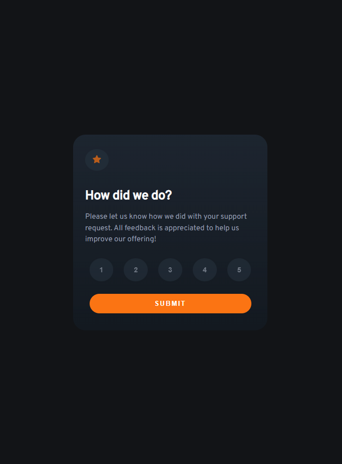

# Frontend Mentor - Interactive rating component solution

This is a solution to the [Interactive rating component challenge on Frontend Mentor](https://www.frontendmentor.io/challenges/interactive-rating-component-koxpeBUmI).  
This is also my very first React app. I'm open to all suggestions and improvements.  

## Table of contents

- [Overview](#overview)
  - [The challenge](#the-challenge)
  - [Screenshot](#screenshot)
  - [Links](#links)
- [My process](#my-process)
  - [Built with](#built-with)
  - [What I learned](#what-i-learned)
  - [Useful resources](#useful-resources)
- [Author](#author)

## Overview

### The challenge

Users should be able to:

- View the optimal layout for the app depending on their device's screen size
- See hover states for all interactive elements on the page
- Select and submit a number rating
- See the "Thank you" card state after submitting a rating

### Screenshot

### Links

- Live Site URL: [Github Page](https://tolexia.github.io/learning-react/)  

## My process

### Built with

- Semantic HTML5 markup
- CSS custom properties
- Flexbox
- [React](https://reactjs.org/) - React framework

### What I learned

Create a basic yet interactive react parent component, composed with several component children

### Useful resources

- [Access props in functional component](https://medium.com/@PhilipAndrews/react-how-to-access-props-in-a-functional-component-6bd4200b9e0b) Helped me toggle active state on rate marks
- [Loop inside JSX](https://stackoverflow.com/questions/22876978/loop-inside-react-jsx) - Helped me create 5 rate marks with the same component

## Author

- Website - [Tolexia](https://www.your-site.com)
- Frontend Mentor - [@Tolexia](https://www.frontendmentor.io/profile/Tolexia)
